# Welcome to MEDEASE 👋

> A Scalable medical application designed to make healthcare more accessabile to patients , doctors and admins

## Author

👤 **Ahmed Emad**

* Github: [@ahmedemad1542](https://github.com/ahmedemad1542)
* LinkedIn: [@Ahmed Emad](https://linkedin.com/in/Ahmed Emad)

## Show your support

Give a ⭐️ if this project helped you!

***
_This README was generated with ❤️ by [readme-md-generator](https://github.com/kefranabg/readme-md-generator)_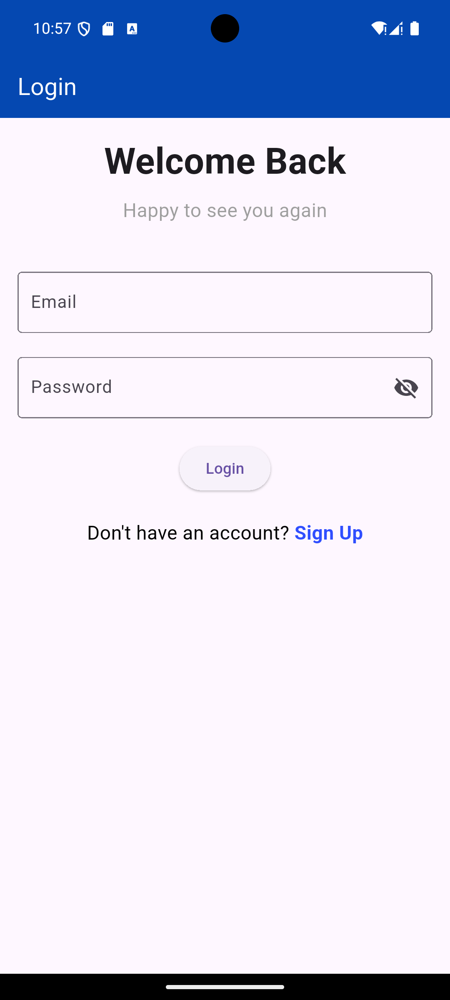 
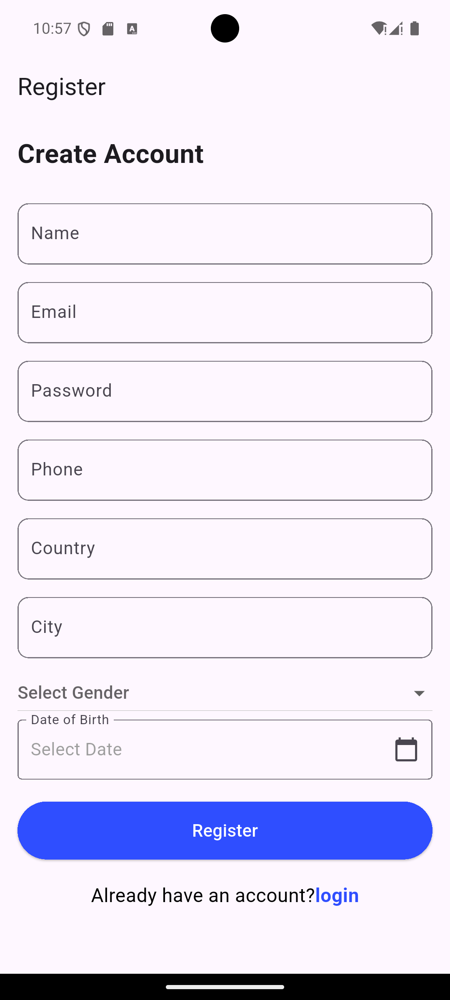 
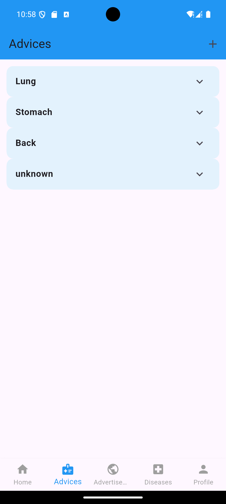 
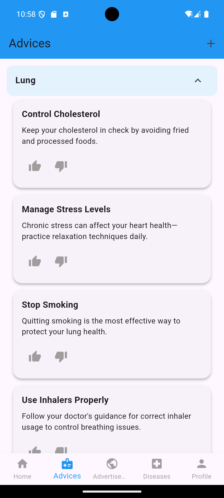 
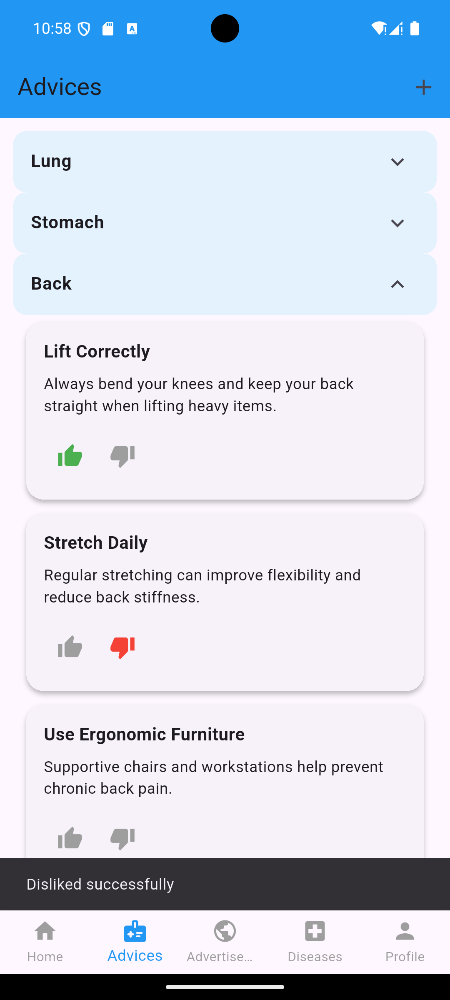 
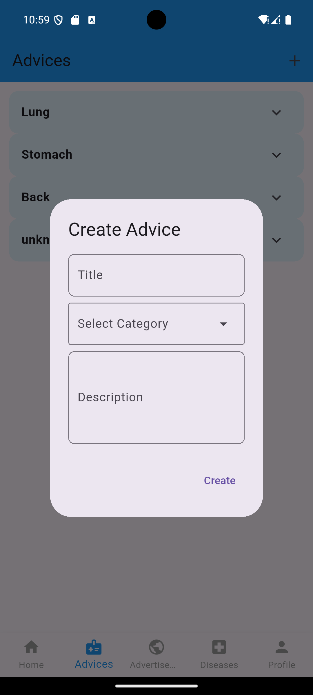 
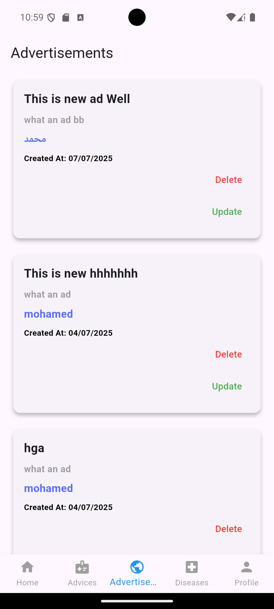 
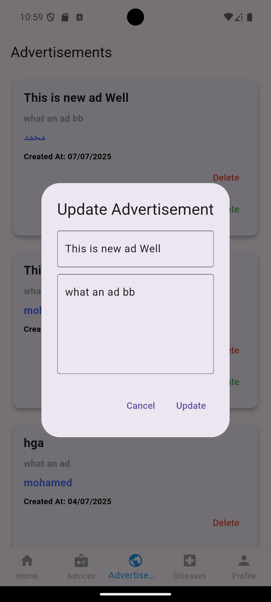 
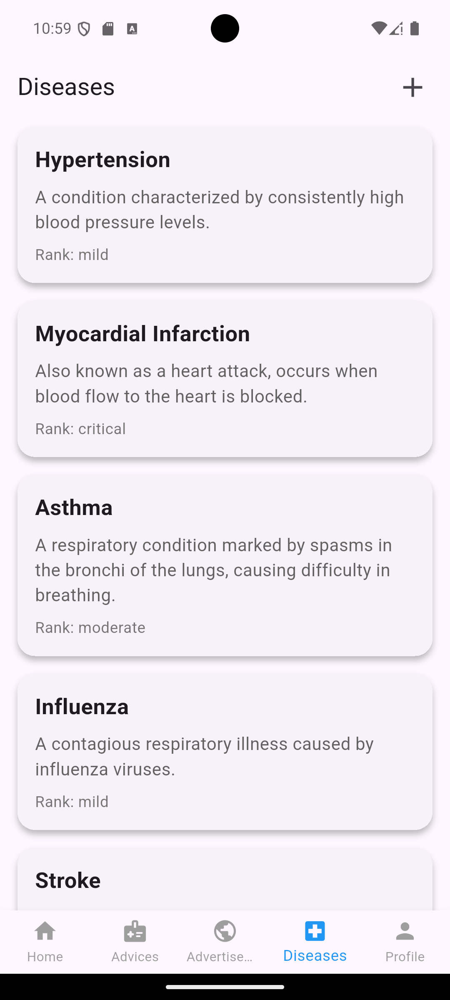 
 
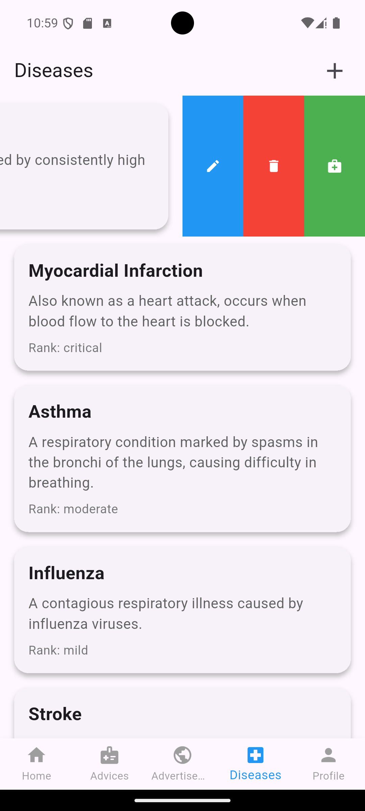 
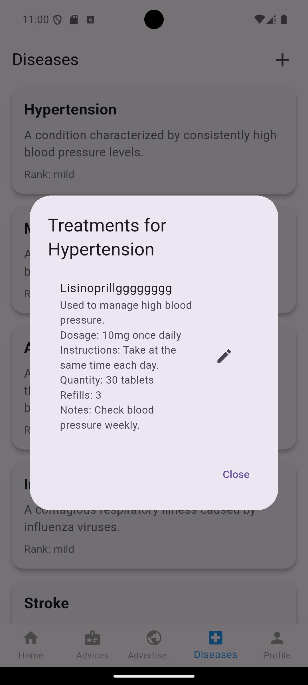 
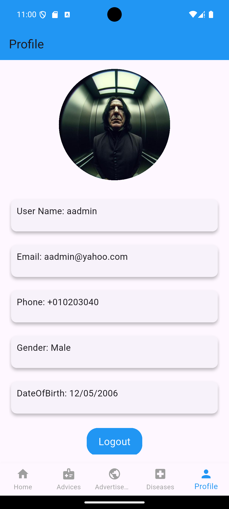 
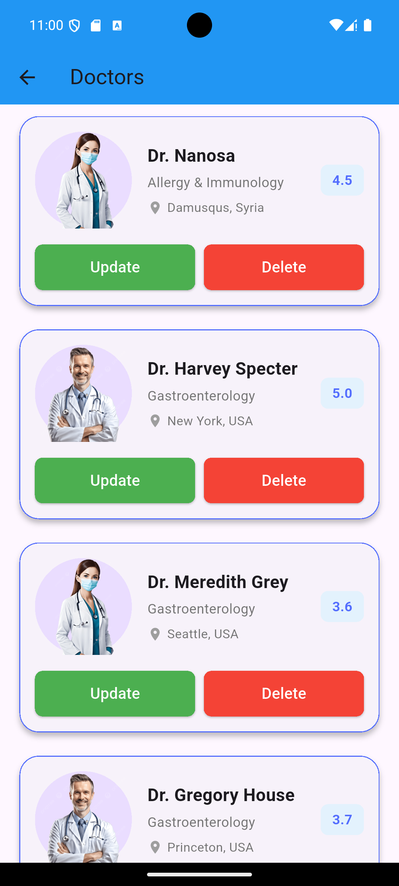 
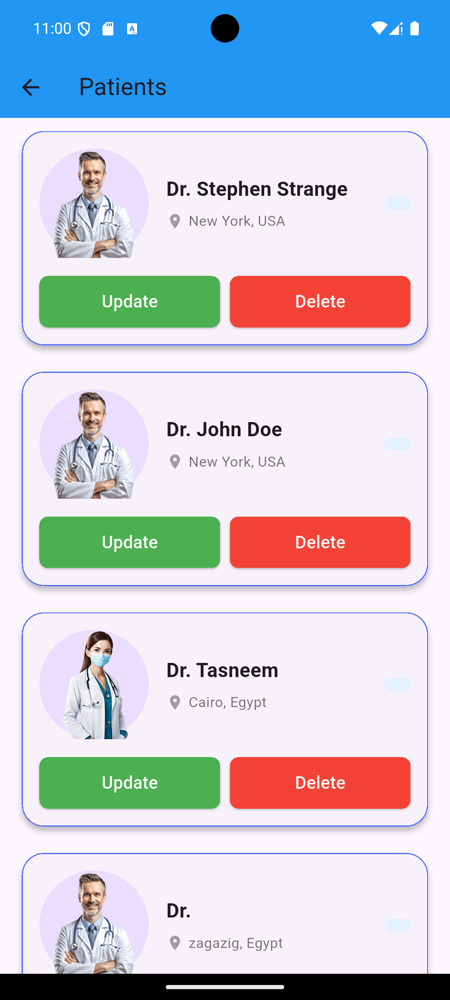 
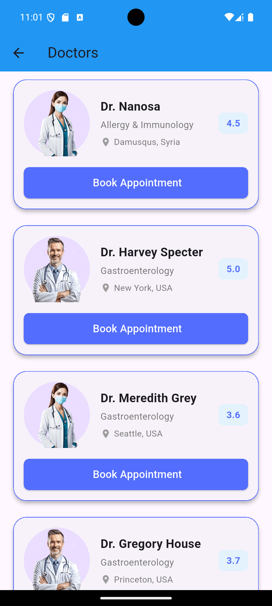 
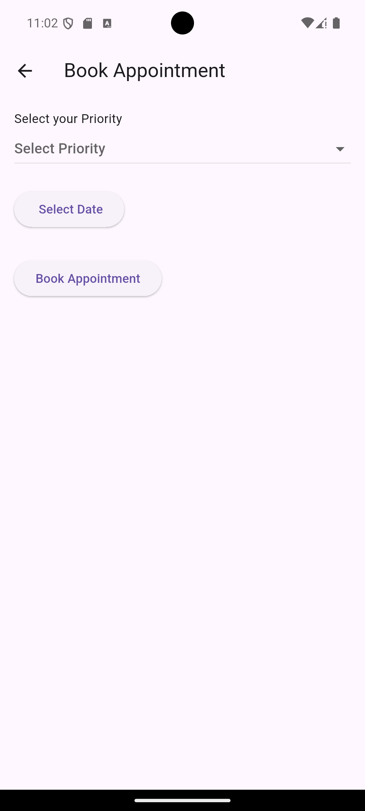 
 
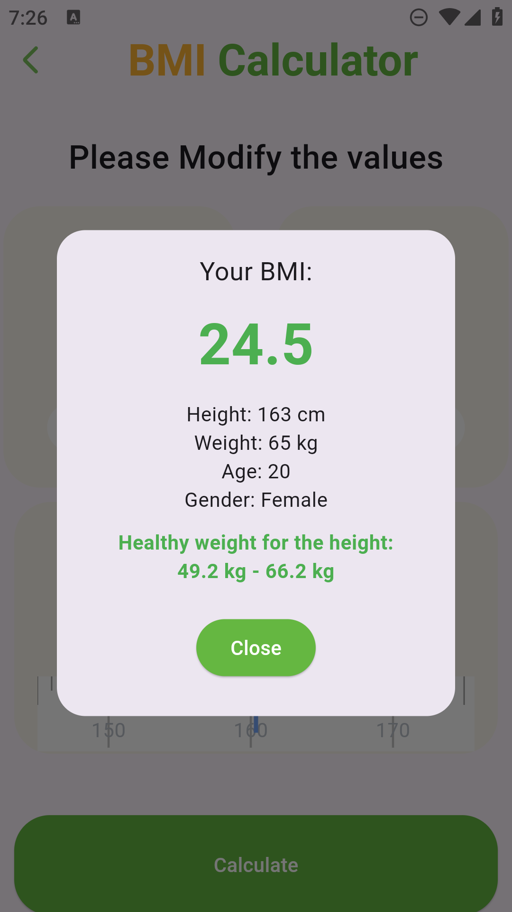 
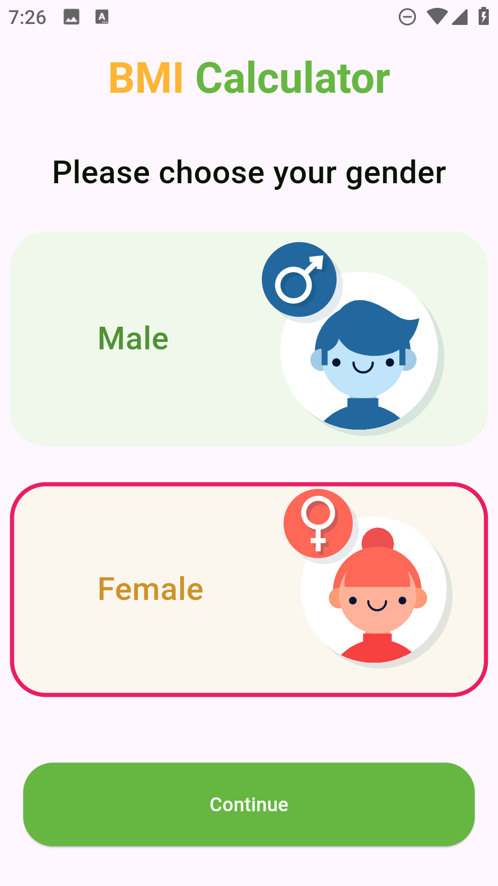 
